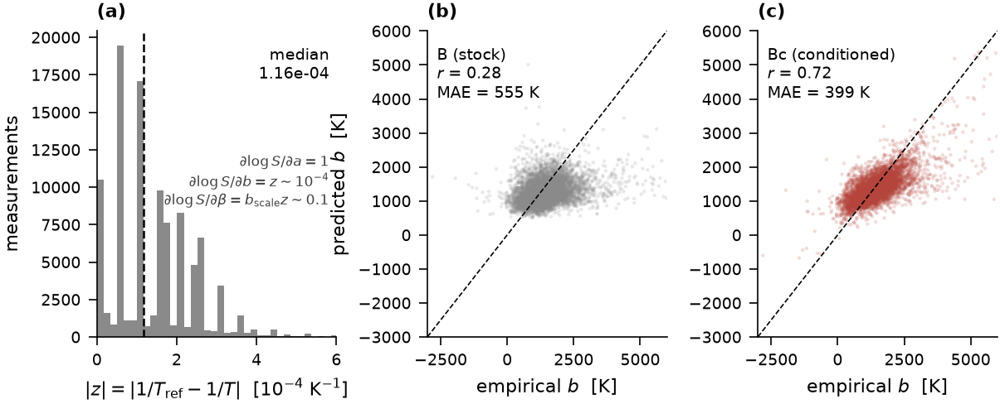
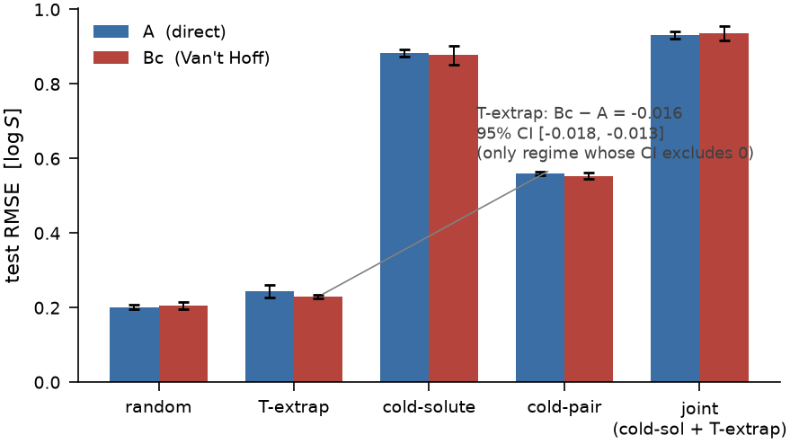

# BigSolDB-T

**Thermodynamic inductive bias for temperature-dependent molecular solubility prediction under distribution shift**

## Problem

Solubility depends on both chemistry and temperature. The temperature part has
known physical structure — the Van't Hoff relation. This project studies whether
building that structure into a neural network improves temperature-dependent
solubility prediction, and under which kinds of distribution shift it does not.

Two matched models are compared on BigSolDB 2.0 (100,983 measurements, 1,445
solutes, 70 solvents):

```
direct             solute + solvent + T  ->  NN  ->  log S

physics-informed   solute + solvent      ->  NN  ->  (a, b)
                                          log S(T) = a + b (1/T_ref - 1/T)
```

Both use the same encoder, backbone and training setup, so the only difference
is how temperature enters. They are evaluated on unseen temperatures, unseen
molecules, and both at once.

## Main findings

1. Van't Hoff describes the temperature dependence in this dataset well:
   per-pair fits give a median R² ≈ 0.9965.
2. The direct Van't Hoff head is badly conditioned. Its slope gradient is
   suppressed by `|z| = |1/T_ref − 1/T| ≈ 10⁻⁴` while the intercept gradient is
   O(1), so the two outputs differ in natural scale by about 1000×.
3. A scale-aware reparameterisation fixes this without changing the function
   class. Slope recovery improves from r ≈ 0.19 to r ≈ 0.73, and temperature
   extrapolation improves for known chemistry.
4. It does not improve generalisation to unseen solutes. That error is
   dominated by the intercept — the absolute solubility level — rather than the
   temperature slope.
5. Conclusions from a single chemistry split can reverse when the held-out
   chemistry changes, so chemistry-shift results are checked with repeated
   group holdouts.
6. A GINE encoder matches the descriptor model in-distribution and helps on
   cold-pair, but does not reliably improve cold-solute transfer or the
   intercept error.

## Results at a glance

The conditioned head recovers per-pair temperature slopes that the direct head
does not:



Performance across evaluation regimes. The physics head helps on temperature
extrapolation but not under chemistry shift:



Publication-quality PDFs for all figures are in
[`results/final_figures/`](results/final_figures), and the corresponding tables
in [`results/final_tables/`](results/final_tables).

## Models

| Model | Temperature treatment | Output |
|---|---|---|
| **A** | raw `T` as an NN input | `log S` |
| **D** | `T` and `1/T` as NN inputs | `log S` |
| **B** | Van't Hoff, hard form | `(a, b)` |
| **Bc** | conditioned Van't Hoff | `(a, β)` |
| **A_GINE / Bc_GINE** | learned graph representation | direct or Van't Hoff head |

Bc is the same physical model as B. It folds a constant into the temperature
variable (`b = β · b_scale`, with `b_scale` fitted on training data only) so that
both head outputs are on comparable numerical scales.

## Evaluation

| Split | What is held out |
|---|---|
| random | nothing (measurement-level interpolation) |
| T-extrapolation | the upper 25 % of each pair's temperature range |
| cold-solute | whole solutes |
| cold-pair | solute–solvent pairings of molecules seen elsewhere |
| cold-solvent | whole solvents (exploratory; only 7 held out) |
| joint | unseen solutes, scored on their unseen high temperatures |

Chemistry-shift conclusions use five independent held-out-solute partitions
rather than a single split, because one partition proved able to give an
overconfident result.

## Data

This project uses **BigSolDB 2.0** by Krasnov et al. (*Scientific Data* **12**,
1236, 2025; DOI [`10.1038/s41597-025-05559-8`](https://doi.org/10.1038/s41597-025-05559-8)).
The dataset is third-party research data, not created by this repository's
author, and is included here for reproducibility. Original data, metadata and
provenance: Zenodo [`10.5281/zenodo.15094979`](https://doi.org/10.5281/zenodo.15094979).
See [`data/README.md`](data/README.md) for attribution and the exact subset used.

## Repository layout

```
notebooks/              analysis workflow, 01 -> 12
notebooks/archive/      superseded single-seed notebooks, kept for provenance
scripts/                models, training loops, graph construction, split helpers
docs/                   sign conventions; pre-registered GINE design
results/final_figures/  publication figures (PDF)
results/final_tables/   dataset, benchmark and mechanism tables (CSV)
data/                   BigSolDB 2.0 (third-party) + attribution
```

## Reproducing

```
1  01_audit                       dataset audit
2  02_prepare_features            RDKit descriptors -> 347-dim representation
3  03_make_splits                 the five frozen splits
4  python scripts/prepare_b_scale.py     training-only b_scale
5  06_multiseed_benchmark         A / D / B / Bc, 3 seeds
6  07_vanthoff_diagnostics        fits, slope recovery, bootstrap, error decomposition
7  08_distribution_shift_stress_tests    repeated holdouts, joint shift
8  09_temperature_sparsity        1 / 2 / 3 / all temperatures per pair
9  10_gine                        MLP vs GINE, direct vs physics head
10 11_gine_coldsol_robustness     repeated cold-solute holdouts for GINE
11 12_final_figures               figures and tables (no training)
```

Notebooks 10–11 additionally use `scripts/graphs.py` and
`scripts/make_joint_split.py`. Large intermediates (cached features, splits,
predictions, checkpoints) are regenerated by these steps and are not tracked.

**Reproducibility note.** Training is deterministic on a fixed machine, but
exact bitwise agreement across platforms is **not** guaranteed: early stopping
is a discrete choice, so small floating-point differences can select a
different checkpoint. Every matched comparison reported here was therefore run
within a single environment; `results/parity_report.md` documents that check.

## Documentation

- [`docs/vanthoff_conventions.md`](docs/vanthoff_conventions.md) — sign
  conventions, the `b`/ΔH relation, and how `b_scale` is defined.
- [`docs/gine_experiment_design.md`](docs/gine_experiment_design.md) — design
  note for the GINE experiment: hypothesis, comparison and interpretation criteria.

## Tech stack

Python · PyTorch · PyTorch Geometric · RDKit · scikit-learn · NumPy / pandas /
SciPy · Matplotlib

## Licence

The MIT License in this repository applies to the original code in this project
(see [`LICENSE`](LICENSE)). Third-party data, including BigSolDB 2.0, remains
subject to the terms and attribution requirements of its original source.

## Status

**Modeling phase complete. Final figure/table consolidation and manuscript
preparation in progress.**
